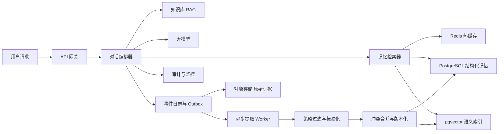
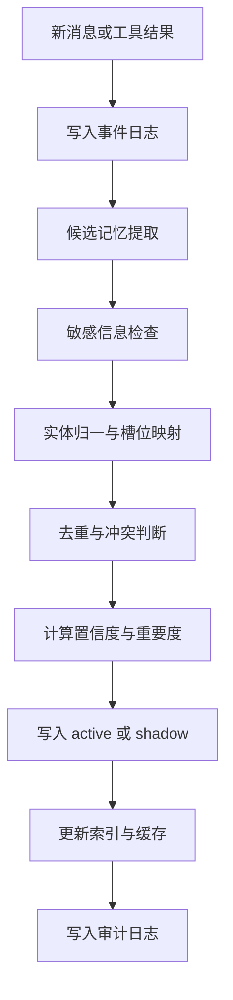
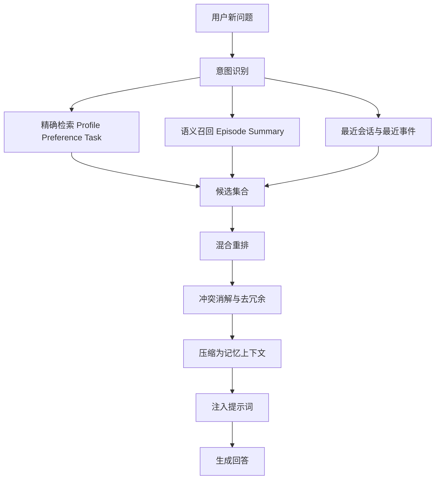

下面这份方案默认场景是：**面向 AI 助手 / Agent 的跨会话记忆系统**。
如果让我拍板上线，我会选这一套：

## 一句话结论

**最好的可上线方案**不是“把所有聊天都存起来”，而是：

**“分层记忆模型 + 结构化记忆对象 + PostgreSQL 真源 + pgvector 语义检索 + Redis 热缓存 + 对象存储事件日志 + 异步写入、同步读取 + 版本化、可追溯、可遗忘”**

这套方案最适合上线，因为它同时满足四件事：

1. **效果稳定**：记住的是“事实对象”，不是一堆原始聊天文本
2. **工程可控**：主存储简单，事务清晰，容易排查问题
3. **成本合理**：读链路轻，写链路异步，不把大模型放在主路径上
4. **合规可信**：能解释为什么记住，能修改，能删除，能彻底遗忘

---

## 一、核心设计原则

### 1. 记忆不是聊天记录

聊天记录是原始事件，记忆是从事件中提炼出的**可检索、可更新、可失效**的对象。

### 2. 当前指令永远高于旧记忆

优先级必须固定：

**系统指令 > 开发者指令 > 用户本轮最新要求 > 显式策略记忆 > 长期记忆 > 历史会话**

也就是说，**记忆只能辅助，不能压过当前用户的新要求**。

### 3. 在线读取必须快，写入必须异步

读取是实时链路，必须低延迟。
写入可以晚一点，但必须可靠，因此采用：

* **读取同步**
* **写入异步**
* **事件日志可回放**

### 4. 只记“值得记住的”，不是“能存下的”

真正长期有用的，通常只有这几类：

* 稳定画像
* 用户偏好
* 正在进行的任务
* 重要事件
* 长期总结
* 显式约束

### 5. 记忆必须带证据、版本和生命周期

每条记忆都要能回答三个问题：

* 这条记忆从哪来
* 它现在是否仍然有效
* 用户要求删除时能不能彻底消掉

---

## 二、总体架构

### 架构说明

这套架构分成两条链路：

**读链路**
用户发起请求后，对话编排器同步调用记忆检索器，从结构化记忆、向量索引、缓存中拿到最相关的记忆，再与知识库内容一起送给大模型。

**写链路**
会话结束后，把本轮消息和工具结果写入事件日志，通过异步 Worker 抽取候选记忆，做过滤、归一、去重、合并、版本化，然后再写入数据库和向量索引。

### 为什么这样拆

因为**写记忆不应该阻塞回答**。
如果每次回答前都做提取、分类、归纳、合并，线上延迟会非常差，故障面也会变大。

---

## 三、记忆分层模型

我建议把记忆拆成 6 层，而不是做一个“大杂烩记忆库”。

| 记忆层  | 内容           | 例子               | 写入条件          | 默认保留策略       | 检索优先级 |
| ---- | ------------ | ---------------- | ------------- | ------------ | ----- |
| 会话记忆 | 当前会话最近上下文    | 本轮提到的文件、任务       | 自动            | 仅会话内         | 最高    |
| 画像记忆 | 稳定身份信息       | 职业、语言、时区         | 用户明确说或高置信重复出现 | 长期有效，直到被更新   | 高     |
| 偏好记忆 | 风格和选择倾向      | 默认中文、喜欢简洁、偏好某种格式 | 用户明确说，或多次重复一致 | 软过期，例如 180 天 | 高     |
| 任务记忆 | 正在进行中的事项     | 正在写周报、正在准备面试     | 明确承诺、待办、未完成状态 | 完成后再保留短期     | 很高    |
| 事件记忆 | 具体发生过的重要事件   | 某次会议结论、一次失败原因    | 重要度高的事件才写入    | 30 到 90 天    | 中     |
| 总结记忆 | 从事件中提炼出的长期模式 | 用户长期偏好结论先行       | 周期性汇总生成       | 定期刷新         | 中     |

### 额外再加一类：策略记忆

这是最容易被忽视，但实际最重要的一类。

比如：

* 不要记录某类敏感信息
* 默认中文输出
* 不要主动提及某个话题
* 只给结论，不给展开版

这类记忆必须是**显式的**，并且优先级高于普通偏好记忆。

---

## 四、核心数据模型

我建议至少有 4 张核心表：

### 1. `memory_item`

存真正可被检索的记忆对象。

核心字段建议如下：

| 字段                 | 说明                                                         |
| ------------------ | ---------------------------------------------------------- |
| `memory_id`        | 记忆唯一 ID                                                    |
| `tenant_id`        | 租户 ID                                                      |
| `app_id`           | 应用或助手 ID                                                   |
| `owner_type`       | `user`、`workspace`、`assistant`                             |
| `owner_id`         | 具体用户或空间 ID                                                 |
| `type`             | `profile`、`preference`、`task`、`episode`、`summary`、`policy` |
| `slot`             | 规范槽位，例如 `output_language`                                  |
| `content`          | 给模型看的自然语言描述                                                |
| `canonical_value`  | 结构化标准值，建议 JSON                                             |
| `confidence`       | 置信度                                                        |
| `importance`       | 重要度                                                        |
| `sensitivity`      | 敏感等级                                                       |
| `status`           | `active`、`shadow`、`superseded`、`expired`、`deleted`         |
| `valid_from`       | 生效时间                                                       |
| `valid_to`         | 失效时间                                                       |
| `source_event_id`  | 来源事件                                                       |
| `version`          | 版本号                                                        |
| `last_verified_at` | 最近确认时间                                                     |
| `embedding`        | 向量字段或向量引用                                                  |

### 2. `memory_evidence`

存证据，用来回答“为什么记住”。

| 字段                  | 说明                                                                    |
| ------------------- | --------------------------------------------------------------------- |
| `evidence_id`       | 证据 ID                                                                 |
| `memory_id`         | 对应记忆                                                                  |
| `source_type`       | `user_explicit`、`user_inferred`、`tool_verified`、`assistant_generated` |
| `source_turn_id`    | 对应会话轮次                                                                |
| `evidence_text`     | 证据摘录                                                                  |
| `extractor_version` | 提取器版本                                                                 |

### 3. `memory_feedback`

存用户反馈。

| 字段            | 说明                                   |
| ------------- | ------------------------------------ |
| `feedback_id` | 反馈 ID                                |
| `memory_id`   | 对应记忆                                 |
| `action`      | `confirm`、`reject`、`forget`、`update` |
| `actor`       | 用户或管理员                               |
| `created_at`  | 时间                                   |

### 4. `memory_edge`

可选，用于表达关系图。

例如：

* 用户 -> 喜欢 -> 结论先行
* 任务 -> 依赖 -> 某份文档
* 用户 -> 负责 -> 某项目

**第一版不要上独立图数据库**。
先用 `edge` 表就够了，只有当多跳关系检索成为核心需求时，再拆到专门图库。

---

## 五、命名空间设计

这是生产系统里非常关键的一点。

记忆作用域建议至少包含：

**`tenant_id + app_id + owner_type + owner_id + namespace`**

这样可以避免几类线上事故：

1. 同一个用户在不同产品里的记忆串线
2. 同一个用户的个人记忆和团队记忆串线
3. 不同助手机器人共享了不该共享的偏好

我建议至少分成两类命名空间：

* **个人记忆**
* **工作空间记忆**

默认只查个人记忆，只有明确业务场景才查工作空间记忆。

---

## 六、写入链路设计

### 写入的正确策略

#### 1. 先记事件，再抽记忆

先把原始消息和工具结果可靠落盘，再做异步提取。
这样以后你可以：

* 重放历史数据
* 更换提取规则后重建记忆
* 审查提取错误来源

#### 2. 采用“规则 + 小模型”混合提取

不要纯靠大模型自由发挥。
正确做法是：

* **规则**负责抓明确表达、日期、数值、状态变更
* **小模型**负责抽取偏好、任务、事件总结

#### 3. 来源要分级

我建议默认可信度顺序如下：

**用户明确表达 > 工具验证结果 > 用户弱表达推断 > 助手自己说的话**

重点是：
**助手自己生成的内容，默认不要写入长期记忆**。
否则系统很容易把幻觉当事实记住。

#### 4. 引入 `shadow` 状态

不是所有候选都直接进长期记忆。

建议规则：

* 明确表达：直接 `active`
* 重复两次以上且一致：`active`
* 单轮弱推断：先 `shadow`
* 高敏感内容：默认拒绝或等待显式确认
* 用户要求忘记：直接 `deleted` 并触发清除

`shadow` 的好处是避免“一次误判永久污染”。

---

## 七、读取链路设计

### 读取的正确策略

#### 1. 先做检索计划，不要全库乱搜

系统先判断用户当前问题需要哪类记忆。

例如：

* “帮我继续写上次那份方案” -> 任务记忆、最近事件记忆优先
* “以后都用中文回答” -> 偏好记忆写入
* “我是谁” -> 画像记忆
* “你还记得我上次说的会议结论吗” -> 事件记忆

#### 2. 必须混合检索

真正稳定的线上效果，一定不是单一路径。

建议三路并行：

* **结构化精确检索**：画像、偏好、任务
* **向量语义召回**：事件、总结
* **时间近邻检索**：最近会话、最近验证过的记忆

#### 3. 必须做重排

我建议默认打分公式可以这样设计：

**总分 = 相关性 0.35 + 精确匹配 0.20 + 置信度 0.15 + 新近度 0.10 + 重要度 0.10 + 已验证度 0.10 - 冲突惩罚 - 敏感惩罚**

这是一个很适合上线的默认配方，因为它兼顾：

* 当前问题相关
* 用户当前状态
* 记忆质量
* 时间衰减
* 风险控制

#### 4. 给模型的记忆必须是“声明式”的

不要把原始长文本直接塞给模型。
应该压缩成简洁、声明式、可解释的格式，例如：

* 策略：默认用中文，结论前置
* 偏好：偏好简洁、结构化表达
* 任务：正在设计记忆系统方案
* 事件：曾要求图使用 Mermaid，并且节点文字使用双引号

这会明显降低噪声和提示污染。

---

## 八、冲突、更新、遗忘

### 1. 冲突处理

正确策略不是覆盖，而是**版本化替换**。

例如：

* 旧记忆：喜欢详细回答
* 新记忆：现在更喜欢简洁明了

应该做的是：

* 旧记忆改成 `superseded`
* 新记忆创建新版本并设为 `active`

### 2. 时间衰减

不同记忆要有不同保留策略：

| 类型          | 建议策略               |
| ----------- | ------------------ |
| 画像记忆        | 长期有效，直到被更新         |
| 偏好记忆        | 软过期，例如 180 天无验证就降权 |
| 任务记忆        | 完成后短期保留，再过期        |
| 事件记忆        | 30 到 90 天          |
| 总结记忆        | 周期性重算与刷新           |
| `shadow` 记忆 | 短期存在，例如 7 到 14 天   |

### 3. 遗忘机制

必须支持三层删除：

1. **逻辑删除**：对外不可见
2. **索引撤销**：向量和缓存同步失效
3. **物理清除**：后台清除原始证据和衍生摘要

### 4. 用户可控

产品层面必须给用户这几个能力：

* 查看我被记住了什么
* 删除某条记忆
* 关闭长期记忆
* 禁止记录某类信息
* 查看“为什么系统会这么回答”

这是建立信任的关键功能，不是锦上添花。

---

## 九、安全与合规

这一部分必须从第一版就设计进去，不要后补。

### 1. 默认不记高敏感内容

例如：

* 密码、令牌、密钥
* 银行卡、支付账号
* 证件号
* 精确住址
* 高敏感健康信息

除非业务确实必须、且用户明确授权，否则不要进入长期记忆。

### 2. 记忆不是可执行指令

记忆内容只能作为**事实性上下文**存在，不能当系统指令执行。
这样可以减少提示注入和历史污染。

### 3. 多租户隔离

至少要做到：

* 行级隔离
* 加密存储
* 审计日志
* 删除留痕
* 导出能力

### 4. 证据可追溯

每条记忆都要能追到：

* 来源轮次
* 来源角色
* 提取版本
* 最近一次确认时间

---

## 十、推荐技术选型

如果目标是“真的能上线、能运维、能扩展”，我建议默认选型如下：

| 组件      | 推荐                        |
| ------- | ------------------------- |
| 真源数据库   | PostgreSQL                |
| 向量检索    | pgvector                  |
| 热缓存     | Redis                     |
| 原始事件与证据 | 对象存储                      |
| 异步可靠投递  | Outbox Pattern，规模大后再接消息队列 |
| 提取器     | 规则 + 小模型                  |
| 重排器     | 轻量重排模型或小模型                |
| 观测      | 指标、日志、审计、回放工具             |

### 为什么不建议第一版直接上很多组件

因为很多团队会一上来就做：

* 单独消息队列
* 单独向量库
* 单独图数据库
* 单独搜索引擎
* 多级工作流引擎

这不是“先进”，而是**过度工程**。
第一版最好的方案，应该是：

**一个主库打底，写链路异步化，读链路混合检索化，所有关键对象可回放、可审计、可删除。**

---

## 十一、默认参数建议

| 参数            | 建议值              |
| ------------- | ---------------- |
| 结构化精确召回数      | 20               |
| 向量召回数         | 50               |
| 重排后最终注入数      | 8 到 12           |
| 记忆提示词预算       | 400 到 800 tokens |
| 偏好记忆软过期       | 180 天            |
| 事件记忆保留        | 30 到 90 天        |
| `shadow` 记忆保留 | 7 到 14 天         |
| 删除传播目标        | 缓存秒级，索引分钟级       |

---

## 十二、上线指标

我建议上线后至少盯这几类指标：

| 指标    | 说明               |
| ----- | ---------------- |
| 记忆命中率 | 被真正用到的记忆占比       |
| 错误记忆率 | 用错记忆、串线记忆、过期记忆占比 |
| 用户修正率 | 用户纠正系统记忆的频率      |
| 检索延迟  | 读链路 P95          |
| 写入成功率 | 事件到记忆的最终落库成功率    |
| 删除成功率 | 删除请求是否在规定时间内完成   |
| 记忆有效性 | 被引用后是否提升回答质量     |

### 一个实用的目标

* 记忆检索 **P95 小于 150ms**
* 记忆写入异步完成 **秒级到低秒级**
* 错误个性化率尽量压到很低
* 删除链路必须可观测、可追踪

---

## 十三、推荐上线顺序

### 阶段 1

只做：

* 画像记忆
* 偏好记忆
* 任务记忆

这是最容易产生用户感知价值的三类。

### 阶段 2

加入：

* 事件记忆
* 总结记忆
* 用户可查看与删除

### 阶段 3

加入：

* 工作空间共享记忆
* 反馈闭环
* 自动重算与质量回放

### 阶段 4

再考虑：

* 更复杂的关系推理
* 独立图库
* 更高级的长期总结策略

---

## 十四、为什么我认为这套是“最好的可上线方案”

因为它避开了三种最常见的失败路线：

### 1. 把聊天记录当记忆

结果是噪声巨大、召回不稳、提示污染严重。

### 2. 只做纯向量库

结果是不好更新、不好冲突处理、不好解释、不好删除。

### 3. 一开始就上超复杂分布式架构

结果是还没验证效果，系统复杂度已经爆炸。

真正可上线的最优解应该是：

**“少而准、结构化、可演进”**
而不是
**“多而全、先堆技术、以后再治理”**

---

## 最终拍板版本

如果你现在就要落地，我会直接定这个版本：

**PostgreSQL + pgvector + Redis + 对象存储 + Outbox 异步 Worker + 结构化记忆对象 + 混合检索 + 版本化 + 可遗忘 + 审计后台**

