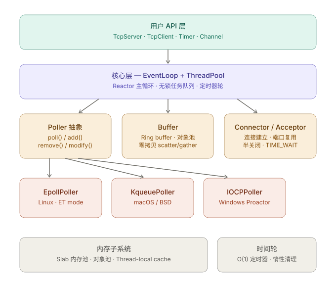

---

### 1. Poller 抽象（平台隔离核心）

```cpp
// poller.h — 纯虚接口，平台无关
class Poller {
public:
    using ChannelList = std::vector<Channel*>;
    virtual ~Poller() = default;

    // 一次 poll，返回就绪的 channel 列表
    virtual Timestamp poll(int timeoutMs, ChannelList* active) = 0;
    virtual void updateChannel(Channel* ch) = 0;
    virtual void removeChannel(Channel* ch) = 0;

    // 工厂方法 — 编译期选择实现
    static std::unique_ptr<Poller> create(EventLoop* loop);

protected:
    std::unordered_map<int, Channel*> channels_;
};

// 编译期平台选择
#if defined(__linux__)
#  include "epoll_poller.h"
   std::unique_ptr<Poller> Poller::create(EventLoop* loop) {
       return std::make_unique<EpollPoller>(loop);
   }
#elif defined(__APPLE__) || defined(__FreeBSD__)
#  include "kqueue_poller.h"
   std::unique_ptr<Poller> Poller::create(EventLoop* loop) {
       return std::make_unique<KqueuePoller>(loop);
   }
#elif defined(_WIN32)
#  include "iocp_poller.h"
   std::unique_ptr<Poller> Poller::create(EventLoop* loop) {
       return std::make_unique<IocpPoller>(loop);
   }
#endif
```

---

### 2. EventLoop — Reactor 主循环

```cpp
class EventLoop {
public:
    using Task = std::function<void()>;

    EventLoop()
        : running_(false),
          threadId_(std::this_thread::get_id()),
          poller_(Poller::create(this)),
          timerWheel_(std::make_unique<TimingWheel>()),
          wakeupFd_(createWakeupFd())   // eventfd / pipe
    {}

    void loop() {
        running_ = true;
        while (running_) {
            activeChannels_.clear();
            Timestamp now = poller_->poll(timerWheel_->nextTimeout(), &activeChannels_);

            for (Channel* ch : activeChannels_)
                ch->handleEvents(now);

            timerWheel_->tick(now);
            drainPendingTasks();   // 跨线程投递的任务
        }
    }

    // 线程安全：可从任意线程调用
    void runInLoop(Task task) {
        if (isInLoopThread()) {
            task();
        } else {
            queueInLoop(std::move(task));
        }
    }

    void queueInLoop(Task task) {
        {
            std::lock_guard<std::mutex> lk(mutex_);
            pendingTasks_.push_back(std::move(task));
        }
        wakeup();   // 唤醒 poll 阻塞
    }

    bool isInLoopThread() const {
        return threadId_ == std::this_thread::get_id();
    }

private:
    void drainPendingTasks() {
        std::vector<Task> tasks;
        {
            std::lock_guard<std::mutex> lk(mutex_);
            tasks.swap(pendingTasks_);
        }
        for (auto& t : tasks) t();
    }

    void wakeup() { /* 写 1 字节到 wakeupFd_ */ }

    std::atomic<bool> running_;
    std::thread::id   threadId_;
    std::unique_ptr<Poller>      poller_;
    std::unique_ptr<TimingWheel> timerWheel_;
    int wakeupFd_;

    std::mutex         mutex_;
    std::vector<Task>  pendingTasks_;    // 跨线程任务队列
    std::vector<Channel*> activeChannels_;
};
```

---

### 3. 无锁环形 Buffer

```cpp
// 适合单个连接的读写缓冲 — SPSC 场景
class RingBuffer {
    static constexpr size_t kAlign = 64;  // cache line
public:
    explicit RingBuffer(size_t cap)
        : buf_(cap), mask_(cap - 1)
    {
        assert((cap & mask_) == 0);  // 必须 2 的幂
    }

    // 无锁写（writer 线程）
    bool write(const void* data, size_t len) {
        size_t w = writePos_.load(std::memory_order_relaxed);
        size_t r = readPos_.load(std::memory_order_acquire);
        if (buf_.size() - (w - r) < len) return false;   // 满
        // ... 拷贝，处理绕回
        writePos_.store(w + len, std::memory_order_release);
        return true;
    }

    // 无锁读（reader 线程）
    size_t read(void* out, size_t len) {
        size_t r = readPos_.load(std::memory_order_relaxed);
        size_t w = writePos_.load(std::memory_order_acquire);
        size_t avail = w - r;
        len = std::min(len, avail);
        // ... 拷贝，处理绕回
        readPos_.store(r + len, std::memory_order_release);
        return len;
    }

private:
    alignas(kAlign) std::atomic<size_t> writePos_{0};
    alignas(kAlign) std::atomic<size_t> readPos_{0};
    std::vector<char> buf_;
    size_t mask_;
};
```

---

### 4. 对象池（连接复用）

```cpp
template <typename T>
class ObjectPool {
public:
    template <typename... Args>
    T* acquire(Args&&... args) {
        T* obj = nullptr;
        if (!free_.pop(obj)) {
            obj = allocator_.allocate(1);
        }
        new (obj) T(std::forward<Args>(args)...);
        return obj;
    }

    void release(T* obj) {
        obj->~T();
        if (!free_.push(obj)) {
            allocator_.deallocate(obj, 1);
        }
    }

private:
    // MPSC 无锁栈，实际可用 boost::lockfree::stack 或自实现
    LockfreeStack<T*> free_;
    std::allocator<T> allocator_;
};
```

---

### 5. 时间轮（O(1) 定时器）

```cpp
class TimingWheel {
    static constexpr int kSlots = 512;
    static constexpr int kTickMs = 10;
public:
    using Callback = std::function<void()>;

    TimerId add(int delayMs, Callback cb) {
        int ticks = std::max(1, delayMs / kTickMs);
        int slot  = (current_ + ticks) & (kSlots - 1);
        auto id   = nextId_++;
        slots_[slot].push_back({id, std::move(cb)});
        return id;
    }

    void tick(Timestamp now) {
        while (lastTick_ + kTickMs <= now.ms()) {
            current_ = (current_ + 1) & (kSlots - 1);
            for (auto& entry : slots_[current_])
                entry.cb();
            slots_[current_].clear();
            lastTick_ += kTickMs;
        }
    }

    int nextTimeout() const {
        return kTickMs - (nowMs() - lastTick_);
    }

private:
    struct Entry { TimerId id; Callback cb; };
    std::array<std::vector<Entry>, kSlots> slots_;
    int current_{0};
    int64_t lastTick_{nowMs()};
    TimerId nextId_{0};
};
```

---

### 设计要点总结

| 关注点 | 方案 |
|--------|------|
| 线程安全 | one-loop-per-thread，跨线程只投任务 |
| 内存 | 对象池 + slab，避免 malloc 热路径 |
| 无锁 | SPSC ring buffer，atomic task queue |
| 定时器 | 时间轮 O(1)，替代 priority_queue |
| 跨平台 | Poller 虚接口 + 工厂，编译期选后端 |
| 零拷贝 | `writev` scatter-gather，Windows 用 `WSASend` |

