这是一套面向 AI Agent 的任务管理与核算系统的完整功能图谱：六个模块，逐一说明：

**任务生命周期管理** — 核心是状态机：`pending → running → done/failed/cancelled`，每个任务支持 DAG 依赖建模（任务 B 等任务 A 的输出），配合超时和重试策略（指数退避、最大重试次数）。

**执行过程管控** — 每一步操作都要留痕：调了什么工具、传了什么参数、返回什么结果。中间状态持久化解决长任务被打断的问题，断点续跑是 AI Agent 区别于普通任务队列的关键需求。

**资源消耗核算** — 这是"核算"的主体。细粒度到单次 tool call 级别：prompt tokens、completion tokens、第三方 API 调用次数都要单独计费。需要支持预算上限硬截断（超预算自动暂停而非继续烧钱），以及按项目/用户维度做成本分摊。

**质量评估与反馈** — AI 任务的特殊性：结果对不对不能只靠 exit code 判断。需要自动评分（规则 + 模型评估）+ 人工审核节点的混合机制，失败原因要分类（模型幻觉 / 工具调用失败 / 超时 / 输入歧义），反馈数据最终可回流训练。

**多智能体协作** — 针对 Orchestrator + Subagent 架构。核心问题是：谁干什么（角色注册）、干完了怎么汇总（子任务聚合）、上下文怎么跨 Agent 传递不丢失。

**系统管控与可观测性** — 权限隔离（Agent 不能访问超出范围的工具）、全链路 Trace（一个外部请求能追踪到哪个 Agent 的哪个步骤）、速率熔断（防止 Agent 失控循环调用）。

最底层两层是基础设施：**数据层**（任务存储 + 事件溯源，事件溯源便于回放和审计）和**接入层**（MCP 协议是目前 AI Agent 生态的事实标准，值得优先支持）。

---
